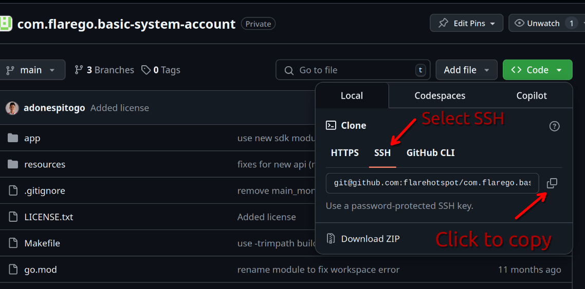

# Testing Via Git

Instructions on how to test the system using Git.

## Initial setup

First, make sure you have clone the core system repository. You only have to this once:

```
cd ~/
git clone git@github.com:flarehotspot/flarehotspot.git
```

Then, you need to "change directory" to the core system directory which is the `~/flarehotspot` directory.

```
cd ~/flarehotspot
```

From here, you can do any of the following to check for new branch and new updates to the core system codes:

`git fetch` - to fetch new created branches
`git branch` - to show the current and local branches
`git branch -a` - to show current, local and remote branches
`git pull` - to pull the new updated codes from the remote origin branch to the local branch
`git checkout [branch name]` - to change to a new branch
`git status` - to check for any errors in the current branch
`git reset --hard` - to fix errors in the current branch
`git clean -f` - also fix errors in the current branch

---

## Testing a new branch in the core system

To test new branch in the core system, first navigate to the `flarehotspot` directory:

```
cd ~/flarehotspot
```

Then check for newly created git branches:

```
git fetch
```

Then checkout the branch you want to test.

```
git checkout [name of the branch]
```

The branch name can be found in the pull request (PR) in the comment section of the task in Click Up.

Then restart the server (make command).

---

## Testing a plugin

To test a new plugin, clone the repository of the plugin to `flarehotspot/plugins/local`. For example, the repository of the plugin is `git@github.com:flarehotspot/com.flarego.basic-system-account.git`:

```
cd ~/flarehotspot/plugins/local
git clone git@github.com:flarehotspot/com.flarego.basic-system-account.git
cd com.flarego.basic-system-account
```

If the plugin is already cloned, you don't have to clone it again.

Then, checkout the name of the branch to be tested:

```
git checkout [branch name]
```

The branch name can be found in the pull request in the comment section of the task in Click Up.

---

## Frequently Asked Questions (FAQ for testers)

### How to clone a repository?

First, you must locate the `SSH` URL of the repository. You can find this in the repository's GitHub page, usually under a green button labeled "Code".


